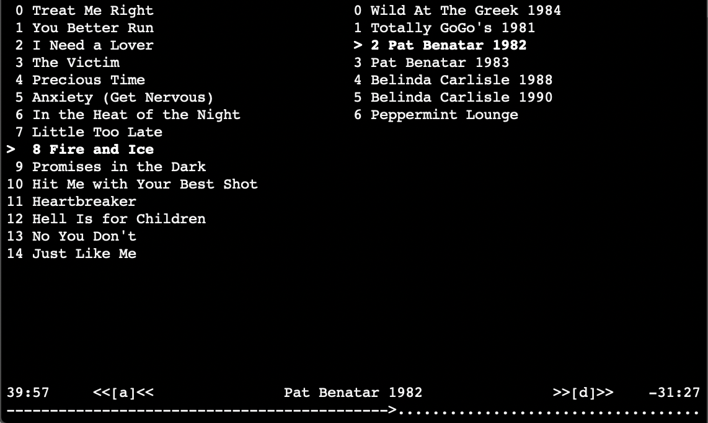
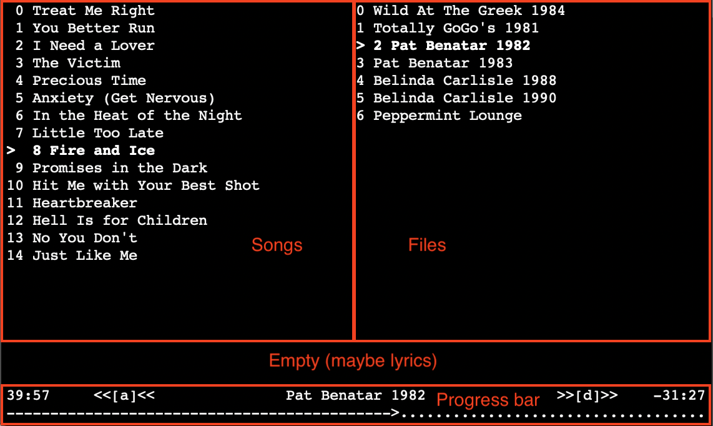

Control iTunes from terminal

When you so bored during quarantine that you made a GUI for iTunes in terminal

For tracking songs in concerts/compilations

It is developed using `ncurses` and `applescript`

To compile, run `make`

Features:
- Click on song/file to play
- use `a` or `d` to go to the previous or next song

Screenshot:

Interface:
